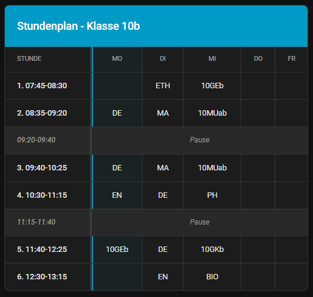
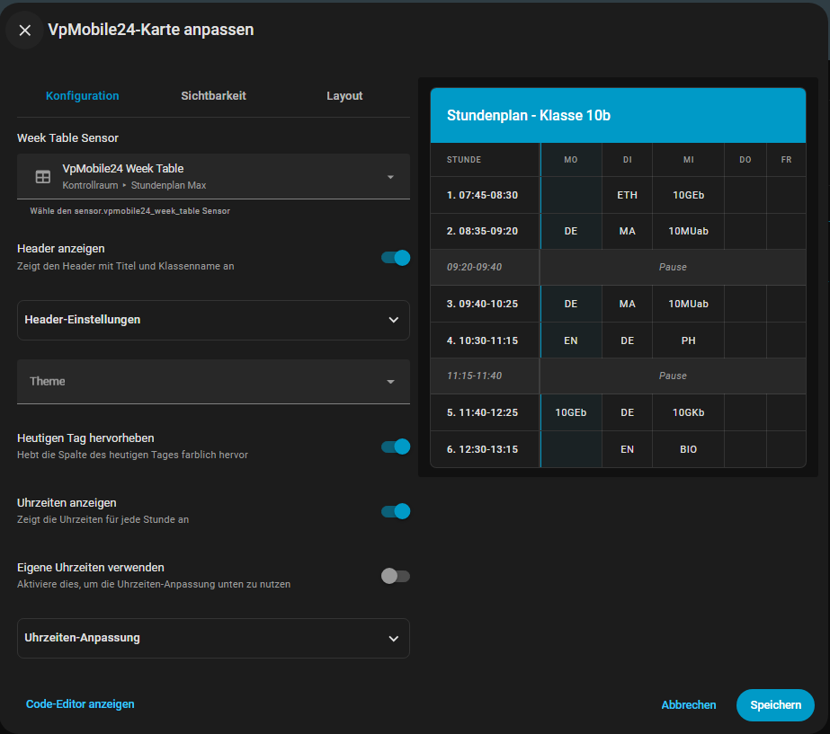

# VpMobile24 Home Assistant Integration

[](https://github.com/hacs/integration)
[](https://github.com/Maximilian-Andrew-Kluge/VpMobile24/releases)

[](https://discord.gg/57uvCeRw43)

---

## 📸 Screenshots

### Stundenplan Card

<table>
  <tr>
    <td></td>
    <td></td>
  </tr>
  <tr>
    <td align="center"><b>Stundenplan Ansicht</b><br/>Wochenübersicht mit Hervorhebung</td>
    <td align="center"><b>Visueller Editor</b><br/>Einfache Konfiguration ohne YAML</td>
  </tr>
</table>

---

## ✨ Features

### 🎓 Integration
- ✅ **Automatischer Abruf** von Vertretungsplänen
- ✅ **Wochentabellen-Sensor** mit allen Stunden
- ✅ **Tägliche Sensoren** für jeden Wochentag (Mo-Fr)
- ✅ **Mehrere Klassen** gleichzeitig möglich
- ✅ **Automatische Updates** alle 15 Minuten

### 🎨 Lovelace Card
- ✅ **Visueller Editor** - Keine YAML-Kenntnisse nötig!
- ✅ **Automatische Installation** - Card wird beim Start kopiert
- ✅ **Wochenansicht** (Montag bis Freitag)
- ✅ **Anpassbarer Header** mit Titel und Klassenname
- ✅ **Hervorhebung** des heutigen Tages
- ✅ **Vertretungen** werden rot markiert
- ✅ **Flexible Uhrzeiten** - 1-10 Stunden konfigurierbar
- ✅ **Pausen** - 0-5 Pausen mit individuellen Zeiten
- ✅ **Theme-Integration** - Passt sich automatisch an
- ✅ **Responsive Design** - Funktioniert auf Handy und Desktop

---

## 📦 Installation & Einrichtung

### Schritt 1: Integration & Card installieren

#### Option A: HACS (Empfohlen)

[](https://my.home-assistant.io/redirect/hacs_repository/?repository=VpMobile24&category=Integration&owner=Maximilian-Andrew-Kluge)

1. **Klicke auf den Badge oben** oder:
2. Öffne **HACS** in Home Assistant
3. Gehe zu **"Integrationen"**
4. Klicke auf die **drei Punkte** oben rechts
5. Wähle **"Benutzerdefinierte Repositories"**
6. Füge hinzu: `https://github.com/Maximilian-Andrew-Kluge/VpMobile24`
7. Kategorie: **Integration**
8. Klicke auf **"Hinzufügen"**
9. Suche nach **"VpMobile24"** und installiere es
10. **Starte Home Assistant neu**

#### Option B: Manuelle Installation

1. Lade die neueste Version von [GitHub Releases](https://github.com/Maximilian-Andrew-Kluge/VpMobile24/releases) herunter
2. Entpacke die ZIP-Datei
3. Kopiere den Ordner `custom_components/vpmobile24` nach `/config/custom_components/`
4. Deine Ordnerstruktur sollte so aussehen:
   ```
   /config/custom_components/vpmobile24/
   ├── __init__.py
   ├── manifest.json
   ├── vpmobile24-card.js
   └── ...
   ```
5. **Starte Home Assistant neu**

#### Card-Ressource hinzufügen

**Die Card wird beim Neustart automatisch nach `/config/www/vpmobile24/` kopiert!** 🎉

Füge jetzt die Ressource hinzu:

1. Gehe zu **Einstellungen** → **Dashboards**
2. Klicke oben rechts auf die **drei Punkte** (⋮)
3. Wähle **"Ressourcen"**
4. Klicke auf **"+ Ressource hinzufügen"**
5. Trage ein:
   - **URL**: `/local/vpmobile24/vpmobile24-card.js`
   - **Ressourcentyp**: `JavaScript-Modul`
6. Klicke auf **"Erstellen"**
7. **Leere den Browser-Cache** (Strg+F5)

### Schritt 2: Integration einrichten

1. Gehe zu **Einstellungen** → **Geräte & Dienste**
2. Klicke auf **"+ Integration hinzufügen"**
3. Suche nach **"VpMobile24"**
4. Gib deine Zugangsdaten ein:
   - **Schul-ID** (z.B. "12345")
   - **Benutzername**
   - **Passwort**
   - **Klassenname** (z.B. "5a", "10b")
5. Klicke auf **"Weiter"**

✅ Die Integration erstellt automatisch folgende Sensoren:
- `sensor.vpmobile24_week_table` - Komplette Wochentabelle
- `sensor.vpmobile24_monday` bis `sensor.vpmobile24_friday` - Einzelne Tage

### Schritt 3: Card zum Dashboard hinzufügen

1. Öffne dein Dashboard
2. Klicke auf **"Bearbeiten"** (oben rechts)
3. Klicke auf **"+ Karte hinzufügen"**
4. Suche nach **"VpMobile24 Card"**
5. Konfiguriere die Card über den **visuellen Editor**:
   - Wähle den Sensor `sensor.vpmobile24_week_table` aus
   - Passe Titel und Klassenname an
   - Aktiviere/Deaktiviere Features nach Wunsch
6. Klicke auf **"Speichern"**

✅ **Fertig!** Dein Stundenplan wird jetzt angezeigt.

---

## 🎨 Konfiguration

Die Card kann komplett über den **visuellen Editor** konfiguriert werden - kein YAML nötig!

### Basis-Einstellungen

| Einstellung | Beschreibung | Standard |
|-------------|--------------|----------|
| **Week Table Sensor** | Wähle den Wochentabellen-Sensor | `sensor.vpmobile24_week_table` |
| **Header anzeigen** | Zeigt Titel und Klassenname oben | ✅ An |
| **Theme** | Wähle ein Home Assistant Theme | Auto |
| **Heutigen Tag hervorheben** | Hebt die heutige Spalte farblich hervor | ✅ An |
| **Uhrzeiten anzeigen** | Zeigt die Uhrzeiten für jede Stunde | ✅ An |
| **Eigene Uhrzeiten verwenden** | Aktiviert die Uhrzeiten-Anpassung | ❌ Aus |

---

## 📝 Beispiele

### Einfache Konfiguration (YAML)

```yaml
type: custom:vpmobile24-card
entity: sensor.vpmobile24_week_table
show_header: true
header_settings:
  title: Stundenplan
  class_name: 10b
custom_theme: auto
highlight_today: true
show_time: true
use_custom_times: false
```

### Erweiterte Konfiguration mit eigenen Uhrzeiten

```yaml
type: custom:vpmobile24-card
entity: sensor.vpmobile24_week_table
show_header: true
header_settings:
  title: Mein Stundenplan
  class_name: 10b
custom_theme: auto
highlight_today: true
show_time: true
use_custom_times: true
time_settings:
  lesson_count: 8
  pause_count: 3
  time_1: '08:00-08:45'
  time_2: '08:50-09:35'
  time_3: '09:55-10:40'
  time_4: '10:45-11:30'
  time_5: '11:50-12:35'
  time_6: '12:40-13:25'
  time_7: '13:30-14:15'
  time_8: '14:20-15:05'
  pause_1: '09:35-09:55'
  pause_1_after: 2
  pause_2: '11:30-11:50'
  pause_2_after: 4
  pause_3: '13:25-13:30'
  pause_3_after: 6
```

---

## 🔧 Troubleshooting

### Integration

**Problem: Integration kann nicht hinzugefügt werden**
- ✅ Überprüfe die Zugangsdaten
- ✅ Stelle sicher, dass die Schul-ID korrekt ist
- ✅ Prüfe die Logs: **Einstellungen** → **System** → **Protokolle**

**Problem: Keine Daten verfügbar**
- ✅ Prüfe, ob Daten auf der VpMobile24-Website verfügbar sind
- ✅ Während der Ferien gibt es oft keine Daten (404-Fehler sind normal)
- ✅ Warte 15 Minuten auf das nächste Update

### Card

**Problem: Card wird nicht gefunden**
1. ✅ Stelle sicher, dass die Integration installiert ist
2. ✅ Starte Home Assistant neu (Card wird automatisch kopiert)
3. ✅ Prüfe, ob die Datei existiert: `/config/www/vpmobile24/vpmobile24-card.js`
4. ✅ Prüfe die Logs nach: "Custom card automatically copied"
5. ✅ Füge die Ressource hinzu (siehe Schritt 2 oben)
6. ✅ Leere den Browser-Cache (Strg+F5)

**Problem: Änderungen werden nicht übernommen**
1. ✅ Leere den Browser-Cache (Strg+F5)
2. ✅ Öffne die Browser-Konsole (F12) und prüfe auf Fehler
3. ✅ Stelle sicher, dass Version v2.1.0 geladen wurde

**Problem: Visueller Editor wird nicht unterstützt**
1. ✅ Stelle sicher, dass die Ressource korrekt hinzugefügt wurde
2. ✅ Prüfe die Browser-Konsole (F12) auf JavaScript-Fehler
3. ✅ Leere den Browser-Cache komplett
4. ✅ Starte Home Assistant neu

---

## 🎨 Design

Die Card verwendet ein schlichtes, modernes Design:

- **8px Border-Radius** für abgerundete Ecken
- **Keine Box-Shadow**, nur ein dezenter Border
- **Horizontale Trennlinien** zwischen den Zeilen
- **3px vertikale Trennlinie** zwischen Stunden- und Tages-Spalten
- **1px vertikale Trennlinien** zwischen den Tages-Spalten
- **Vollständige Theme-Integration** - nutzt alle Farben deines Themes
- **Responsive Design** - funktioniert auf allen Geräten

---

## 📋 Changelog

### v2.1.0 (2026) - Aktuell
**Automatisches Card-Deployment**
- ✨ Card wird beim Start automatisch nach `/config/www/vpmobile24/` kopiert
- ✨ Keine manuelle Installation mehr nötig
- ✨ Einfache Ressourcen-URL: `/local/vpmobile24/vpmobile24-card.js`
- ✨ Ordner wird automatisch erstellt
- ✨ Card wird bei jedem Start aktualisiert
- 🔧 Besseres Logging
- 🔧 Zuverlässigere Deployment-Methode

### v2.0.0 (2026)
**Major Release**
- ✨ Visuelle Konfiguration mit getConfigForm()
- ✨ Expandable Sektionen für Header und Uhrzeiten
- ✨ Theme-Integration
- ✨ Konfigurierbare Uhrzeiten (1-10 Stunden)
- ✨ Konfigurierbare Pausen (0-5 Pausen)
- ✨ Vertikale Trennlinien
- ✨ Responsive Design
- 🔧 Optimierte Performance

---

## 🤝 Support

### Hilfe benötigt?

- 📖 Lies die [detaillierte Card-Anleitung](CARD_INSTALLATION.md)
- 🐛 [Erstelle ein Issue auf GitHub](https://github.com/Maximilian-Andrew-Kluge/VpMobile24/issues)
- 💬 Beschreibe dein Problem so genau wie möglich
- 📋 Füge Logs und Screenshots hinzu

### Logs finden
=======
Bei Problemen oder Fragen:
- Erstelle ein Issue auf GitHub: https://github.com/Maximilian-Andrew-Kluge/VpMobile24/issues
- Prüfe die Logs in Home Assistant
- Öffne die Browser-Konsole (F12) für Card-Probleme
- 💬 Discord Support Server: [Hier beitreten](https://discord.gg/57uvCeRw43)

1. Gehe zu **Einstellungen** → **System** → **Protokolle**
2. Suche nach "vpmobile24"
3. Kopiere relevante Fehlermeldungen

### Browser-Konsole öffnen

1. Drücke **F12** in deinem Browser
2. Gehe zum **"Console"** Tab
3. Suche nach Fehlern (rot markiert)

---

## 📄 Lizenz

Siehe [LICENSE](LICENSE) Datei im Repository.

---

**Gefällt dir diese Integration?** Gib dem Projekt einen ⭐ auf GitHub!


