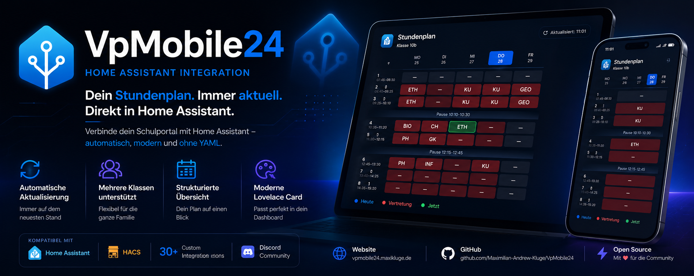
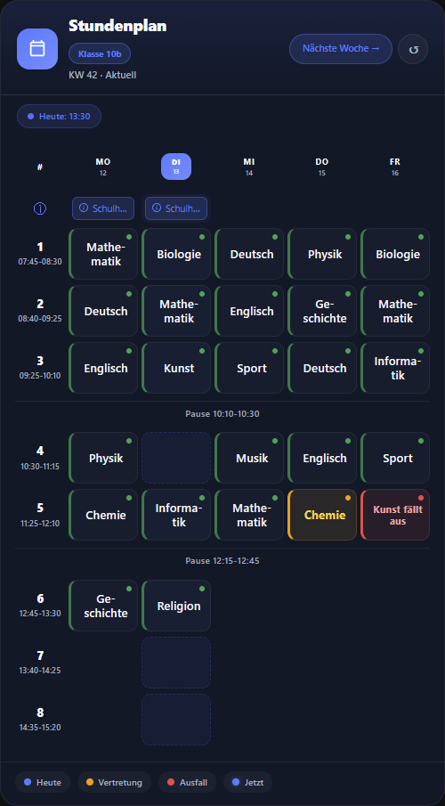
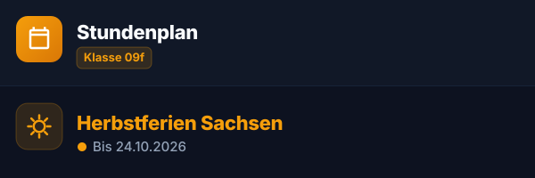
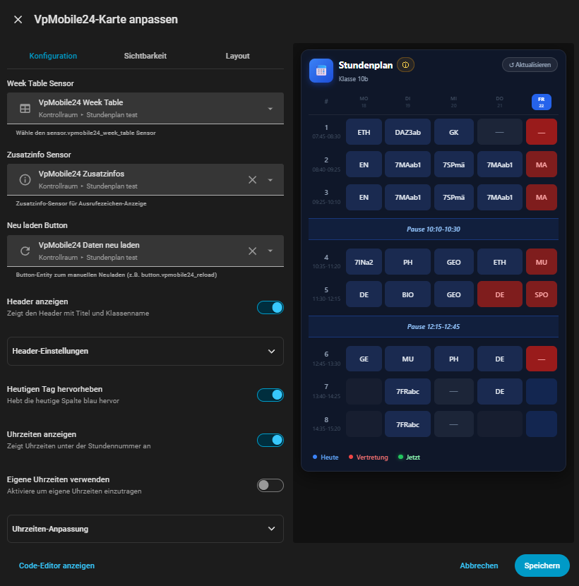
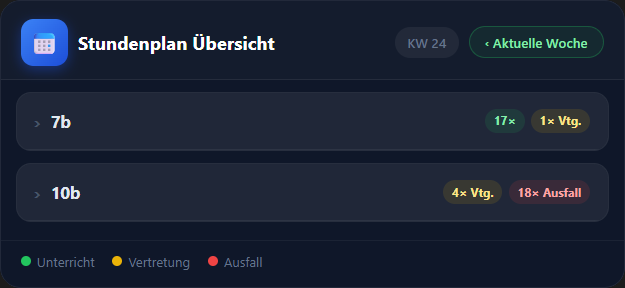
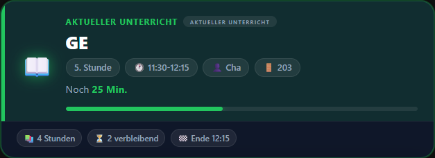

🇬🇧 **[English Documentation](README_EN.md)**

<div align="center">



<br/><br/>

[](https://github.com/hacs/integration)
[](https://github.com/Maximilian-Andrew-Kluge/VpMobile24/releases/latest)
[](https://github.com/Maximilian-Andrew-Kluge/VpMobile24/releases)
[](LICENSE)
[](https://discord.gg/57uvCeRw43)

<br/>

[**📦 Via HACS installieren**](https://my.home-assistant.io/redirect/hacs_repository/?repository=VpMobile24&category=Integration&owner=Maximilian-Andrew-Kluge)
·
[**🌐 Website**](https://maximilian-andrew-kluge.github.io/VpMobile24/website/)
·
[**💬 Discord**](https://discord.gg/57uvCeRw43)
·
[**🐛 Bug melden**](https://github.com/Maximilian-Andrew-Kluge/VpMobile24/issues/new)

</div>

---

## Funktionen seit v2.6.8

Diese Funktionen sind im Entwicklungsstand enthalten, **im Beta-Release v2.6.8 enthalten**. Die Änderungen sind über HACS als Beta verfügbar. Die bestehende Installation muss nicht gelöscht werden.

### Gezielte Änderungsmeldungen

Unter **Einstellungen → Geräte & Dienste → VpMobile24 → Konfigurieren** die Option **Änderungsereignisse für Automationen aktivieren** einschalten. Sie ist standardmäßig ausgeschaltet. Die Integration stellt dann lokale Ereignisse `vpmobile24_schedule_changed` bereit; sie verschickt selbst keine Push-Nachrichten.

Der Vergleich umfasst erfolgreich geladene Tage ab heute einschließlich Vorschauwochen. Er erkennt Ausfall, Wiederaufnahme, Raumwechsel und andere Änderungen an bereits bekannten Stunden. Ein unveränderter Abruf erzeugt keine neue Meldung. Der erste Abruf nach Start/Neustart, neu geladene Tage und geänderte Filter bilden eine neue Vergleichsbasis und bleiben still. Änderungen während einer Abschaltung werden daher nicht nachträglich gemeldet. Fehlgeschlagene Tage behalten ihre Vergleichsbasis; zurückgezogene Pläne gelten nicht als Ausfall. Mehrdeutige Parallelstunden werden nicht geraten. Neu hinzugefügte/entfernte Stunden ohne eindeutige Zuordnung werden nicht gemeldet.

[Automation-Blueprint mit Ruhezeiten und Änderungsarten](blueprints/automation/vpmobile24_changes.yaml): Datei als Blueprint importieren, die Eintrags-ID (`entry_id`) aus einem Ereignis übernehmen und eine Benachrichtigungsaktion wählen. In deren Nachrichtenfeld `{{ message }}` verwenden. Die Sprache kann Deutsch oder Englisch sein. Ereignisse lassen sich unter **Entwicklerwerkzeuge → Ereignisse** beobachten. Sie enthalten persönliche Stundenplandaten; diese nicht öffentlich teilen.

Ruhezeit standardmäßig 22:00–06:00; gleicher Beginn und Ende deaktiviert sie. Meldungen während der Ruhezeit werden verworfen, nicht nachgesendet. Eine Automation pro Empfänger verhindert doppelte Push-Nachrichten durch mehrere Automationen.

### Einrichtung, Karten und Datenstatus

Nach der Klassen-/Lehrerauswahl prüft die Einrichtung die nächsten sieben Tage und zeigt Anzahl sowie Ergebnis: Daten gefunden, keine passenden Stunden, noch nicht veröffentlichte Pläne, Teilabruf, Verbindungs- oder Anmeldefehler. Keine passenden Stunden beweisen kein falsches Kürzel – Ferien und freie Tage sind möglich. Mit nicht gesetzter Bestätigung geht es zurück zur Auswahl. Bei falschen Zugangsdaten die Einrichtung neu starten.

Die Wochenkarte zeigt bei Problemen den letzten gespeicherten Plan mit **Daten veraltet** und Zeitpunkt des letzten vollständig erfolgreichen Abrufs. Mehr als 30 Minuten ohne vollständigen Erfolg, Teilfehler und Abruffehler gelten als veraltet. Dieser Cache liegt im Arbeitsspeicher und überlebt keinen HA-Neustart. Der Datenstatus-Sensor liefert `data_stale`, `last_successful_update` und `failed_dates`. Ausfall und Vertretung sind zusätzlich zur Farbe bereits mit Text gekennzeichnet.

### Datenschutzfreundliche Diagnose

Über das Menü des Integrationseintrags **Diagnose herunterladen**. Die Diagnose enthält nur Version, Betriebsmodus, Abrufstatus/-zeit sowie Anzahlen gespeicherter oder fehlgeschlagener Tage und Ferien. Sie enthält keine Zugangsdaten, Schul-ID, Klassen-/Lehrerkürzel, URLs oder Stundenpläne. Vor dem Anhängen an ein Issue trotzdem den Inhalt ansehen.

### Prüfung vor einem stabilen Release

Automatische Regressionstests prüfen Fehlerfälle und Änderungsvergleiche. Ein vollständiger Praxistest in einer laufenden HA-Instanz mit echten Schuldaten steht aus. Zu prüfen: Einrichtung für Schüler und Lehrer, leerer Plan/Ferien, Neustart, Passwortwechsel/erneute Anmeldung, Wochenwechsel, Serverausfall und Wiederverbindung, eine echte Planänderung und ihre einmalige Benachrichtigung. Nicht als bereits bestanden verstehen.

---

## 🚀 Was ist neu in v2.6.x?

> [!IMPORTANT]
> **VpMobile24 v2.6.5** ist das aktuelle Stable Release. **v2.6.9-beta** ist die aktuelle Beta mit verbesserten HA-Themes, stabiler Farbdarstellung und neu gestalteten Popups.
>
> 🔗 [Alle Release Notes →](https://github.com/Maximilian-Andrew-Kluge/VpMobile24/releases)

| Neu | Beschreibung |
|-----|-------------|
| 👨‍🏫 Lehrermodus | Eigener Modus für Lehrer — Plan nach Lehrerkürzel, Kürzel per Dropdown wählbar |
| 🛡️ Pausenaufsichten | Aufsichten werden im Lehrermodus erkannt und farblich hervorgehoben |
| 📢 Tagesinfos pro Tag | Zusatzinfos direkt pro Wochentag in der Tabelle — Hover für vollen Text, Klick für alle Details |
| 🎓 Oberstufenkurse | Kurze Kurskürzel (z.B. `la1`) werden jetzt korrekt erkannt und angezeigt |
| 0️⃣ Nullte Stunde | Stunde 0 (z.B. 07:50–08:35) wird abgerufen und angezeigt |
| 🔑 Reauth-Flow | Bei Passwortänderung erscheint direkt ein Dialog — kein Löschen/Neu-Einrichten mehr nötig |
| 📐 Kartengröße | Karten frei skalierbar in der Section-/Grid-Ansicht |
| 🔄 Zuverlässige Aktualisierung | Wochentabelle & Reload-Button laden nachträgliche Änderungen jetzt korrekt nach |

<details>
<summary>Frühere Highlights (v2.5.x)</summary>

| Neu | Beschreibung |
|-----|-------------|
| 🏖️ Ferien-Sensor | Automatische Ferienerkennung für alle 16 Bundesländer |
| 🔄 Reload-Animation | Pfeil dreht sich grün beim Aktualisieren |
| 📚 Echtzeit-Erkennung | Aktueller Unterricht erkennt auch Vertretungsstunden |
| 🌙 Vor Schulbeginn | Karte zeigt „Noch kein Unterricht" statt „Pause" |
| 🔵 Parallelkurs-Filter | Ausfälle fremder Kurse werden ausgeblendet |
| 🌐 Zusatzserver | Unterstützung für zusatz1–10 (z.B. für Schulen mit eigenem Server) |
| 🔑 Zugangsdaten ändern | Schul-ID, Passwort & Server nachträglich änderbar |

</details>

---

## 📖 Inhaltsverzeichnis

- [📌 Beschreibung](#-beschreibung)
- [✨ Funktionen](#-funktionen)
- [🚀 Installation](#-installation)
- [⚙️ Einrichtung](#️-einrichtung)
- [🃏 Lovelace Card Beispiele](#-lovelace-card-beispiele)
- [📸 Screenshots](#-screenshots)
- [📋 Hilfe & Tutorial](#-hilfe--tutorial)
- [❓ FAQ](#-faq)
- [🤝 Mitmachen](#-mitmachen)

---

## 📌 Beschreibung

**VpMobile24** bringt deinen Schulstundenplan direkt in Home Assistant — mit automatischen Sensoren, modernen Lovelace-Karten und Schulferien-Erkennung für alle 16 Bundesländer.

**Unterstützt:** Stundenplan24.de · VpMobil24

---

## ✨ Funktionen

<table>
<tr>
<td width="50%" valign="top">

**📡 Sensoren**

| Sensor | Beschreibung |
|--------|-------------|
| `week_table` | Wochentabelle |
| `naechste_stunde` | Nächste Stunde |
| `heutiger_stundenplan` | Heute |
| `zusatzinfos` | Zusatzinformationen |
| `aenderungen` | Vertretungen |
| `aktueller_unterricht` | Aktuelle Stunde |
| `ferien` | 🏖️ Schulferien |

</td>
<td width="50%" valign="top">

**🃏 Lovelace Karten**

- 📅 Wochenansicht (Desktop + Mobile)
- 👥 Mehrere Klassen
- ⏱️ Aktueller Unterricht
- 🏖️ Ferien-Screen
- 📢 Tagesinfos pro Tag (Hover + Klick)
- 🛡️ Pausenaufsichten (Lehrermodus)
- 📐 Frei skalierbar (Grid-Ansicht)
- 🌍 Mehrsprachig: DE / EN / FR
- 🔵 Parallelkurs-Filter
- 🛡️ CSP-sicher (nginx, DuckDNS)

</td>
</tr>
</table>

> [!NOTE]
> **👨‍🏫 Lehrermodus:** Neben dem Schülermodus gibt es jetzt einen eigenen Lehrermodus. Statt einer Klasse wählst du dein Lehrerkürzel (per Dropdown), und die Integration zeigt alle deine Stunden, Vertretungen und Pausenaufsichten.

---

## 🚀 Installation

### Via HACS *(empfohlen)*

[](https://my.home-assistant.io/redirect/hacs_repository/?owner=Maximilian-Andrew-Kluge&repository=VpMobile24&category=integration)

### Manuell

1. Ordner `custom_components/vpmobile24` herunterladen
2. Nach `config/custom_components/vpmobile24` kopieren
3. Home Assistant neu starten

---

## ⚙️ Einrichtung

1. **Einstellungen → Geräte & Dienste → Integration hinzufügen → VpMobile24**
2. **Benutzertyp wählen:** Schüler, Lehrer oder Demo
3. Schul-ID, Passwort (und ggf. Server) eingeben
4. **Schülermodus:** Klasse + Fächer wählen *(Parallel- und Oberstufenkurse einzeln)* · **Lehrermodus:** Lehrerkürzel wählen
5. **Bundesland auswählen** *(für automatische Ferienerkennung)*

> [!TIP]
> Bundesland, Fächer/Kurse, Klasse, Lehrerkürzel und Zugangsdaten lassen sich nachträglich unter **Einstellungen → VpMobile24 → Konfigurieren** ändern. Bei geändertem Passwort erscheint automatisch ein Reauth-Dialog.

---

## 🃏 Lovelace Card Beispiele

<details>
<summary>📅 Stundenplan-Karte</summary>

```yaml
type: custom:vpmobile24-card
entity: sensor.vpmobile24_week_table
```
</details>

<details>
<summary>👥 Mehrere Klassen-Karte</summary>

```yaml
type: custom:vpmobile24-multi-card
entities:
  - sensor.vpmobile24_7a_week_table
  - sensor.vpmobile24_7b_week_table
```
</details>

<details>
<summary>⏱️ Aktueller Unterricht-Karte</summary>

```yaml
type: custom:vpmobile24-current-card
entity: sensor.vpmobile24_aktueller_unterricht
next_entity: sensor.vpmobile24_naechste_stunde
week_entity: sensor.vpmobile24_heutiger_stundenplan
```
</details>

---

## 📸 Screenshots

### Neue Wochenkarte und Popups (v2.6.9 Beta)

Die Wochenkarte folgt mit `theme: ha_default` dem aktiven Home-Assistant-Theme. Helle Stundenflächen, geschlossene Rahmen und stärkere Trennlinien verbessern die Lesbarkeit. Farben werden bei HA-Updates ohne zwischenzeitliches Zurücksetzen übernommen.

Stunden-, Vertretungs- und Ausfall-Popups zeigen kompakte Unterrichtsdetails. Tatsächliche Mitteilungen der Schule stehen bei Änderungen zuerst; Zusatzinformationen sind nach Tag gegliedert. Lange Inhalte scrollen, während die Schließen-Schaltfläche erreichbar bleibt.

Die folgenden Bilder wurden zur Anonymisierung bearbeitet; Namen und Lehrerkürzel sind abgedeckt.


| Vertretung | Ausfall |
|---|---|
|  |  |

**Update:** In HACS Beta-Versionen anzeigen, `v2.6.9-beta` installieren und Home Assistant neu starten. Bei einer veralteten Ansicht das Dashboard mit Strg + F5 neu laden.

**Geprüft:** 288 lokale Theme-Kombinationen, 540 aufeinanderfolgende HA-Updates sowie 16 Popup-Layouts (Handy/Desktop, hell/dunkel). Diese Browserprüfungen ersetzen keinen vollständigen Live-Test aller HA-Themes.

### 🗓️ Stundenplan

<div align="center">
  
</div>

Die Wochenkarte zeigt alle Stunden auf einen Blick – mit Vertretungen (gelb), Ausfällen (rot), der aktuellen Stunde (blau) und Tagesinfos direkt in der Tabelle.

### 🏖️ Ferienansicht

<div align="center">
  
</div>

Wenn Schulferien erkannt werden, zeigt die Karte automatisch den Feriennamen und das Enddatum – kein leerer Plan, kein Fehler.

### Weitere Ansichten

<table>
<tr>
  <td align="center" width="50%"><b>📅 Wochenübersicht</b><br/><br/>
    
  </td>
  <td align="center" width="50%"><b>🃏 Lovelace Card</b><br/><br/>
    
  </td>
</tr>
<tr>
  <td align="center" width="50%"><b>👥 Mehrere Klassen</b><br/><br/>
    
  </td>
  <td align="center" width="50%"><b>⏱️ Aktueller Unterricht</b><br/><br/>
    
  </td>
</tr>
</table>

---

## 📋 Hilfe & Tutorial

> [!NOTE]
> 🐛 **Bug melden?** Bitte füge die XML-Rohdaten von stundenplan24.de bei — das hilft uns das Problem schnell zu lösen.
>
> 📋 **[→ Anleitung: XML-Daten abrufen](docs/xml-tutorial.md)**

| Ressource | Link |
|-----------|------|
| 📋 XML-Tutorial | [docs/xml-tutorial.md](docs/xml-tutorial.md) |
| 🐛 Bug melden | [GitHub Issues](https://github.com/Maximilian-Andrew-Kluge/VpMobile24/issues/new) |
| 💬 Community | [Discord](https://discord.gg/57uvCeRw43) |
| 🌐 Website | [Zur Website](https://maximilian-andrew-kluge.github.io/VpMobile24/website/) |
| 🔧 Diagnose | Einstellungen → VpMobile24 → Diagnose herunterladen |

---

## ❓ FAQ

<details>
<summary>Welche Schulen werden unterstützt?</summary>

Alle Schulen die **Stundenplan24.de** oder **VpMobil24** verwenden.
</details>

<details>
<summary>Muss ich YAML schreiben?</summary>

Nein — alles ist über die Home Assistant UI konfigurierbar.
</details>

<details>
<summary>Wie funktioniert die Ferienerkennung?</summary>

Bundesland beim Einrichten oder unter Konfigurieren auswählen. Die Daten kommen aus den offiziellen KMK-Ferienplänen.
</details>

<details>
<summary>Was ist der Parallelkurs-Filter?</summary>

In der Fächerauswahl erscheinen alle Kursgruppen (z.B. `789WB10`, `7INb1`, `la1`). Wähle nur deinen Kurs — Ausfälle anderer Gruppen werden dann ausgeblendet. Auch kurze Oberstufenkurse wie `la1` werden korrekt erkannt.
</details>

<details>
<summary>Gibt es einen Lehrermodus?</summary>

Ja. Beim Einrichten „Lehrer" als Benutzertyp wählen und dein Kürzel per Dropdown auswählen. Die Integration zeigt dann alle deine Stunden, Vertretungen und Pausenaufsichten. Aufsichten werden in der Karte farblich hervorgehoben.
</details>

<details>
<summary>Werden Tagesinfos / Tagesevents angezeigt?</summary>

Ja. Zusatzinfos erscheinen als eigene Zeile pro Wochentag direkt in der Wochentabelle. Hover zeigt den vollen Text, ein Klick öffnet alle Details des jeweiligen Tages.
</details>

<details>
<summary>Meine Schule hat eine nullte Stunde — wird die unterstützt?</summary>

Ja, Stunde 0 (z.B. 07:50–08:35) wird abgerufen und in Tabelle, Karte und Sensoren angezeigt — inklusive Vertretungen und Ausfällen. Schulen ohne nullte Stunde sehen keine leere Zeile.
</details>

<details>
<summary>Probleme nach einem Update?</summary>

1. Integration entfernen
2. Neu konfigurieren
3. Home Assistant neu starten

Bei weiteren Problemen → [GitHub Issue erstellen](https://github.com/Maximilian-Andrew-Kluge/VpMobile24/issues) oder [Discord](https://discord.gg/57uvCeRw43).
</details>

<details>
<summary>Unterstützt die Integration mehrere Klassen?</summary>

Ja — mehrere Klassen und Parallelkurse werden unterstützt. Jede Klasse wird als separate Integration eingerichtet.
</details>

---

## 🤝 Mitmachen

* 🐛 Bug melden → [GitHub Issues](https://github.com/Maximilian-Andrew-Kluge/VpMobile24/issues)
* 💬 Community → [Discord](https://discord.gg/57uvCeRw43)
* 🔧 Pull Request → [CONTRIBUTING.md](CONTRIBUTING.md)

---

<div align="center">

**Mit ❤️ für die Home-Assistant Community entwickelt**

⭐ Hinterlasse einen Stern auf GitHub, wenn dir das Projekt gefällt.

</div>
